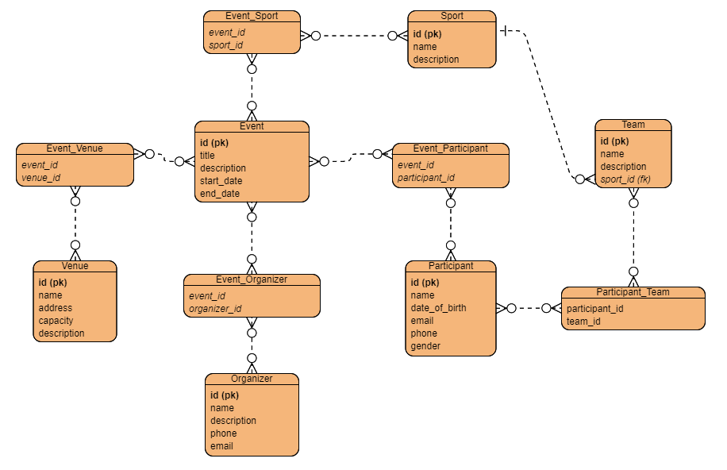

# Команда 20

Тема - *Платформа для организации и управления спортивными мероприятиями*

Состав команды:

* Цимбал Татьяна Николаевна
* Беломытцев Андрей Игоревич
* Захарчук Александр Игоревич
* Русинов Василий Александрович
* Файзулин Радмир Русланович
* Черных Олег Андреевич

# Доменные сущности

## Event

```cs
public class Event
{
    public int Id { get; set; }
    public string Title { get; set; }
    public string Description { get; set; }
    public DateTime StartDate { get; set; }
    public DateTime EndDate { get; set; }
    public List<Venue> Venues { get; } = [];
    public List<Sport> Sports { get; } = [];
    public List<Organizer> Organizers { get; } = [];
    public List<Participant> Participants { get; } = [];
}
```

## Organizer

```cs
public class Organizer
{
    public int Id { get; set; }
    public string Name { get; set; }
    public string Description { get; set; }
    public string Email { get; set; }
    public string Phone { get; set; }
    public List<Event> Events { get; } = [];
}
```

## Participant

```cs
public class Participant
{
    public int Id { get; set; }
    public string Name { get; set; }
    public Date DateOfBirth { get; set; }
    public string Email { get; set; }
    public string Phone { get; set; }
    public string Gender { get; set; }
    public List<Event> Events { get; } = [];
    public List<Team> Teams { get; } = [];
}
```

## Sport

```cs
public class Sport
{
    public int Id { get; set; }
    public string Name { get; set; }
    public string Description { get; set; }
    public List<Event> Events { get; } = [];
    public List<Team> Teams { get; } = [];
}
```

## Team

```cs
public class Team
{
    public int Id { get; set; }
    public string Name { get; set; }
    public string Description { get; set; }
    // внешний ключ
    public int SportId { get; set; }
    // навигационное свойство
    public Sport Sport { get; set; }
}
```

## Venue

```cs
public class Venue
{
    public int Id { get; set; }
    public string Name { get; set; }
    public string Description { get; set; }
    public string Address { get; set; }
    public int Capacity { get; set; }
    public List<Event> Events { get; } = [];
}
```

## ERD Diagram



# API

| Set of methods |
| ------ |
| GET |
| POST |
| PATCH |
| DELETE |

## Event

*Получение списка событий* -- `GET /api/v1/events`
```json
request - нет (параметры могут быть переданы через URL для фильтрации)
response - [{"id": 1, "title": "Чемпионат мира по футболу", "description": "...", "start_date": "2024-06-14", "end_date": "2024-07-15"}, ...]
```

*Создание события* -- `POST /api/v1/events`
```json
request - {"title": "Новое событие", "description": "Описание события", "start_date": "2024-08-01", "end_date": "2024-08-02"}
response - {"id": 2, "title": "Новое событие"}
```

*Обновление события* -- `PATCH /api/v1/events/{event_id}`
```json
request - {"title": "Обновленное событие", "description": "Новое описание", "start_date": "2024-08-01", "end_date": "2024-08-03"}
response - {"id": 2, "title": "Обновленное событие"}
```

*Удаление события* -- `DELETE /api/v1/events/{event_id}`
```json
request - нет
response - {"message": "Событие удалено"}
```

## Venue

*Получение списка мест проведения* -- `GET /api/v1/venues`
```json
request - нет
response - [{"id": 1, "name": "Стадион Лужники", "address": "Москва, ...", "capacity": 80000}, ...]
```

*Создание места проведения* -- `POST /api/v1/venues`
```json
request - {"name": "Новый стадион", "address": "Санкт-Петербург, ...", "capacity": 35000}
response - {"id": 3, "name": "Новый стадион"}
```

*Обновление места проведения* -- `PATCH /api/v1/venues/{venue_id}`
```json
request - {"name": "Обновленный стадион", "address": "Сочи, ...", "capacity": 40000}
response - {"id": 3, "name": "Обновленный стадион"}
```

*Удаление места проведения* -- `DELETE /api/v1/venues/{venue_id}`
```json
request - нет
response - {"message": "Место проведения удалено"}
```

## Organizer

*Получение списка организаторов* -- `GET /api/v1/organizers`
```json
request - нет
response - [{"id": 1, "name": "ФИФА", "description": "...", "phone": "+123456789", "email": "[email protected]"}, ...]
```

*Создание организатора* -- `POST /api/v1/organizers`
```json
request - {"name": "UEFA", "description": "Организация футбольных матчей", "phone": "+987654321", "email": "[email protected]"}
response - {"id": 4, "name": "UEFA"}
```

*Обновление организатора* -- `PATCH /api/v1/organizers/{organizer_id}`
```json
request - {"name": "Обновленная ФИФА", "description": "Новое описание", "phone": "+1234567890", "email": "[email protected]"}
response - {"id": 1, "name": "Обновленная ФИФА"}
```

*Удаление организатора* -- `DELETE /api/v1/organizers/{organizer_id}`
```json
request - нет
response - {"message": "Организатор удален"}
```

## Sport

*Получение списка видов спорта* -- `GET /api/v1/sports`
```json
request - нет
response - [{"id": 1, "name": "Футбол", "description": "Командный вид спорта..."}, ...]
```

*Создание вида спорта* -- `POST /api/v1/sports`
```json
request - {"name": "Баскетбол", "description": "Командная игра с мячом..."}
response - {"id": 2, "name": "Баскетбол"}
```

*Обновление вида спорта* -- `PATCH /api/v1/sports/{sport_id}`
```json
request - {"name": "Обновленный футбол", "description": "Новое описание игры..."}
response - {"id": 1, "name": "Обновленный футбол"}
```

*Удаление вида спорта* -- `DELETE /api/v1/sports/{sport_id}`
```json
request - нет
response - {"message": "Вид спорта удален"}
```

## Participant

*Получение списка участников* -- `GET /api/v1/participants`
```json
request - нет
response - [{"id": 1, "name": "Иван Иванов", "date_of_birth": "1992-04-23", "email": "[email protected]", "phone": "+79031234567", "gender": "male"}, ...]
```

*Создание участника* -- `POST /api/v1/participants`
```json
request - {"name": "Петр Петров", "date_of_birth": "1990-05-15", "email": "[email protected]", "phone": "+79037654321", "gender": "male"}
response - {"id": 2, "name": "Петр Петров"}
```

*Обновление участника* -- `PATCH /api/v1/participants/{participant_id}`
```json
request - {"name": "Иван Сидоров", "date_of_birth": "1992-04-23", "email": "[email protected]", "phone": "+79031234568", "gender": "male"}
response - {"id": 1, "name": "Иван Сидоров"}
```

*Удаление участника* -- `DELETE /api/v1/participants/{participant_id}`
```json
request - нет
response - {"message": "Участник удален"}
```

## Team

*Получение списка команд* -- `GET /api/v1/teams`
```json
request - нет
response - [{"id": 1, "name": "Команда А", "description": "Команда высшего уровня..."}, ...]
```

*Создание команды* -- `POST /api/v1/teams`
```json
equest - {"name": "Команда B", "description": "Новая команда..."}
response - {"id": 2, "name": "Команда B"}
```

*Обновление команды* -- `PATCH /api/v1/teams/{team_id}`
```json
request - {"name": "Команда A+", "description": "Обновленное описание..."}
response - {"id": 1, "name": "Команда A+"}
```

*Удаление команды* -- `DELETE /api/v1/teams/{team_id}`
```json
request - нет
response - {"message": "Команда удалена"}
```

> ### Query-параметры 
> Фильтрация событий по дате начала: `GET /api/v1/events?start_date=2024-08-01`<br>
> Фильтрация мест проведения по вместимости: `GET /api/v1/venues?capacity=50000`<br>
> Комбинированная фильтрация: `GET /api/v1/events?start_date=2024-08-01&end_date=2024-08-31`<br>

# Services

## Venue

```cs
public interface IVenueService
{
    List<Venue> GetVenues();
    
    List<Venue> GetVenuesBySport(string sportName);
    
    List<Venue> GetVenuesByTime(DateTime startTime, DateTime endTime);
    
    List<Venue> GetVenuesBySportAndTime(string sportName, DateTime startTime, DateTime endTime);
    
    List<Venue> GetVenuesByEvents(List<Event> events);

    Venue GetVenueById(int venueId);

    Venue CreateVenue(Venue newVenue);

    Venue UpdateVenue(int venueId, Venue updatedVenue);

    void DeleteVenue(int venueId);
    
    void DeleteVenues(List<int> venueIds);
}
```

## Event

```cs
public interface IEventService
{
    List<Event> GetEvents();
    
    List<Event> GetEventsBySport(string sportName);
    
    List<Event> GetEventsInTimeRange(DateTime startTime, DateTime endTime);
    
    List<Event> GetEventsBySportInTimeRange(string sportName, DateTime startTime, DateTime endTime);
    
    List<Event> GetEventsByOrganizer(int organizerId);

    Event GetEventById(int eventId);
    
    Event CreateEvent(Event newEvent);
    
    Event UpdateEvent(int eventId, Event updatedEvent);
    
    void DeleteEvent(int eventId);
    
    void DeleteEvents(List<int> eventIds);
}
```

## Organizer

```cs
public interface IOrganizerService
{
    List<Organizer> GetOrganizers();
    
    List<Organizer> GetOrganizersBySport(string sportName);
    
    List<Organizer> GetEventsByEvents(List<Event> events);

    Organizer GetOrganizerById(int organizerId);

    Organizer CreateOrganizer(Organizer newOrganizer);

    Organizer UpdateOrganizer(int organizerId, Organizer updatedOrganizer);

    void DeleteOrganizer(int organizerId);
    
    void DeleteOrganizers(List<int> organizerIds);
}
```

## Sport

```cs
public interface ISportService
{
    List<Sport> GetSports();

    Sport GetSportById(int sportId);
    
    Sport CreateSport(Sport newSport);
    
    Sport UpdateSport(int sportId, Sport updatedSport);
    
    void DeleteSport(int sportId);
}
```

## Participant

```cs
public interface IParticipantService
{
    List<Participant> GetParticipants();
    
    List<Participant> GetParticipantsByAttribute(string attributeName, string attributeValue);

    Participant GetParticipantById(int participantId);
    
    Participant CreateParticipant(Participant newParticipant);
    
    Participant UpdateParticipant(int participantId, Participant updatedParticipant);
    
    void DeleteParticipant(int participantId);
}
```

## Team

```cs
public interface ITeamService
{
    List<Team> GetTeams();

    Team GetTeamById(int teamId);
    
    Team CreateTeam(Team newTeam);
    
    Team UpdateTeam(int teamId, Team updatedTeam);
    
    void DeleteTeam(int teamId);
}
```
